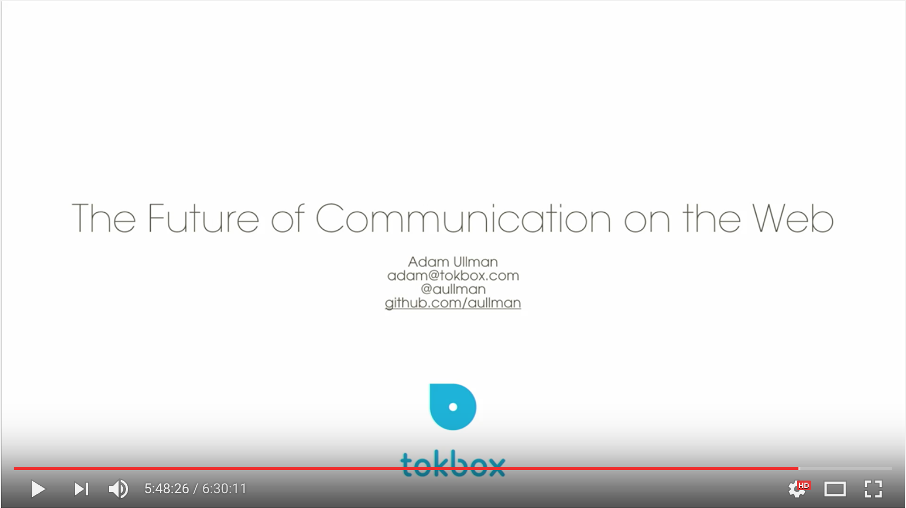

# snapchat-killer
Proof of concept of building snapchat-like app for a web browser using WebRTC

This is a proof of concept Snapchat like app that I did for a [talk I gave](https://youtu.be/atUthkDH154?t=20905) at [Decompress](http://2016.decompress.com.au/). Based on [opentok-camera-filters](https://github.com/aullman/opentok-camera-filters). You can find slides for that talk [here](https://github.com/aullman/aullman.github.com/blob/master/SnapchatForWebDecompress16.pdf).

# Presentation Video

# Running Demo

[https://aullman.github.io/snapchat-killer/](https://aullman.github.io/snapchat-killer/)
